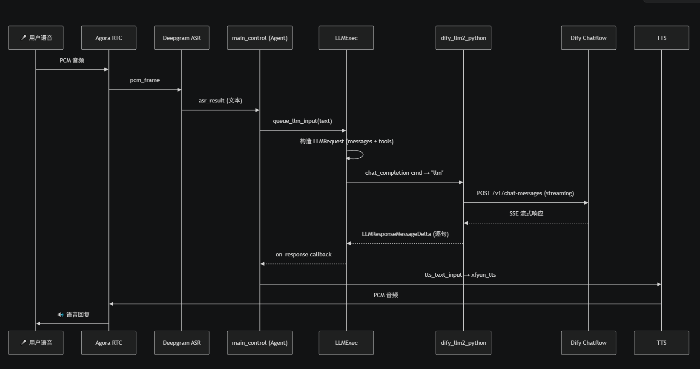

# 代理2001 (Agentsecurity)

<div align="center">

🚀 **基于 TEN Framework 的 AI 语音代理安全管理系统**

[](https://github.com/Zhatd1901/Agentsecurity.git)
[](../LICENSE)
[](https://github.com/TEN-framework/ten-framework)

</div>

---

## 📖 项目简介

**代理2001** 是一套基于 TEN Framework 构建的 AI 语音代理安全管理系统。通过 Twilio 接入电话，利用 Deepgram 进行语音识别（STT）、科大讯飞进行语音合成（TTS），结合 Dify LLM 平台实现访客信息智能收集，最终通过微信推送至管理员进行确认，形成完整的"来电 → AI 对话 → 信息采集 → 人工审核"闭环。

**核心数据流:**

```
Twilio 来电 → STT 语音识别 → Dify Chatflow 智能对话收集信息 → FastAPI 写入 SQLite → 电话挂断 → Dify Workflow 推送微信 → 管理员确认 → 更新数据库
```

---

## 🏗️ 系统架构图


---

## 🔧 TEN Framework 内部逻辑图



---

## 🎯 技术选型说明

### 核心运行时

| 技术 | 选型理由 |
|------|----------|
| **TEN Framework** | 面向实时多模态对话式 AI 的开源框架，提供图编排引擎（Graph Designer）与扩展机制，原生支持 STT/TTS/LLM 等节点以有向图方式组合 AI Pipeline。 |
| **Go (Gin)** | 高性能 HTTP 框架，作为 Agent 进程管理器负责启动/停止/心跳监控，`server/` 目录下仅有数百行代码实现完整的生命周期管理。 |
| **Next.js 15 + TypeScript** | React 全栈框架，提供 Playground Web UI（端口 3000）用于可视化调试 Agent 图编排与实时对话测试。 |

### AI / 语音服务

| 技术 | 选型理由 |
|------|----------|
| **Deepgram (ASR)** | 低延迟流式语音识别，支持实时音频流输入，适合电话场景下的连续语音转文本。 |
| **科大讯飞 (TTS)** | 中文语音合成效果最优，支持多种音色与语速调节，满足访客接待场景对自然语音的要求。 |
| **Dify Chatflow + Workflow** | 开源 LLM 应用开发平台，提供可视化 Chatflow 编排与 Workflow 调度能力，通过 HTTP Request 节点与 FastAPI 中间件无缝对接，实现访客信息收集→入库→推送的完整流程。 |
| **GPT-5.4 (via Dify)** | 作为 Dify 后端的模型中转站，实现对话理解与信息提取。 |

### 后端服务

| 技术 | 选型理由 |
|------|----------|
| **FastAPI (Python)** | 现代异步 Python Web 框架，作为 Dify ↔ SQLite 的中间件桥梁（端口 8000），提供 Swagger 自动文档（`/docs`），便于调试。 |
| **SQLite + SQLAlchemy 2.0 (Async)** | 轻量级嵌入式数据库，零配置部署，适合中小规模访客数据存储；`aiosqlite` 异步驱动保证 FastAPI 异步链路不阻塞。 |
| **Twilio** | 业界领先的云通信平台，提供 SIP/WebRTC 电话接入能力，`voice-assistant-sip-twilio` Agent 直接集成。 |

### 微信集成

| 技术 | 选型理由 |
|------|----------|
| **WeChat Bridge (Node.js/TypeScript)** | 基于微信个人号协议实现的双向桥接服务，支持扫码登录、消息轮询、Dify 回调推送与 @机器人 对话查询，轻量无第三方依赖。 |

### 基础设施

| 技术 | 选型理由 |
|------|----------|
| **Docker Compose** | 一键编排 `ten_agent_dev` + `agentsecurity_fastapi` 双容器，统一网络管理，降低环境配置成本。 |
| **ngrok** | 反向代理隧道工具，用于本地开发时将 Webhook 回调暴露到公网，便于 Twilio/Dify 调试。 |
| **Agora RTC** | 实时音视频通信 SDK（可选），支持 WebRTC 推流与低延迟音频传输。 |

### 硬件终端（可选）

| 技术 | 选型理由 |
|------|----------|
| **ESP32-S3-Korvo-V3** | 乐鑫官方语音开发板，集成麦克风阵列与音频编解码器，适合作为边缘语音终端。 |
| **ReSpeaker XVF3800** | XMOS 语音处理器，支持远场拾音与 AEC 回声消除，配合 XIAO ESP32S3 使用。 |

---

## 📐 项目架构总览

```
┌──────────┐    SIP/WebRTC     ┌──────────────────┐    HTTP/SSE     ┌──────────────┐
│  Twilio  │ ◄──────────────► │  TEN Framework    │ ◄─────────────► │ Dify Chatflow│
│ 电话接入 │                  │ voice-assistant   │                │ 访客信息收集 │
└──────────┘                   └──────┬───────────┘                └──────┬───────┘
                                      │                                    │
                                      │ Go API Server                      │ HTTP POST
                                      │ localhost:8080                     │ /api/visitors/create
                                      ▼                                    ▼
                              ┌──────────────┐                  ┌─────────────────┐
                              │  Playground  │                  │ FastAPI 中间件   │
                              │ Next.js UI   │                  │ localhost:8000   │
                              │ port:3000    │                  │ Dify↔DB↔Workflow │
                              └──────────────┘                  └───────┬─────────┘
                                                                         │
                                                                         │ SQLite
                                                                         ▼
                                                                ┌────────────────┐
                                                                │   SQLite DB    │
                                                                │ visitors 表    │
                                                                │ status 队列    │
                                                                └───────┬────────┘
                                                                        │
                                                                        │ create 成功后触发
                                                                        │ action=new_visitor_created
                                                                        ▼
                                                                ┌────────────────┐
                                                                │ Dify Workflow  │
                                                                │ 队列调度/推送  │
                                                                └───────┬────────┘
                                                                        │
                                                                        │ HTTP POST
                                                                        │ /api/wechat/send
                                                                        ▼
┌──────────┐    ilink API      ┌──────────────────┐    HTTP/API      ┌─────────────────┐
│ 微信 App │ ◄──────────────► │  WeChat Bridge    │ ◄─────────────► │ FastAPI / Clawbot│
│ 个人微信 │                  │ Node.js 桥接      │                │ 微信发送与回调   │
└──────────┘                   └──────────────────┘                └─────────────────┘
```

---

## 组件清单与启动方式

### 方式一：Docker Compose 一键启动（推荐）

```bash
cd ai_agents
cp .env.example .env   # 编辑 .env 填入 API Key
docker compose up -d
```

启动后：
| 服务 | 容器名 | 端口 | 说明 |
|------|--------|------|------|
| TEN Agent Dev | `ten_agent_dev` | 3000, 8080, 9000, 49483 | TEN 运行时 + Playground + Graph Designer |
| FastAPI | `agentsecurity_fastapi` | 8000 | Dify ↔ SQLite 中间件 |

在 `ten_agent_dev` 容器内手动运行 agent:
```bash
docker exec -it ten_agent_dev bash
cd /app/agents/examples/voice-assistant && task run        # 默认语音助手
cd /app/agents/examples/voice-assistant-sip-twilio && task run  # Twilio SIP 版本
```

---

### 方式二：各组件独立启动

#### 1. TEN Framework（核心运行时）

TEN Framework 包含三个子服务：

##### 1a. Go API Server（服务器进程管理器）

负责 agent 进程的启动/停止/心跳管理。

```bash
cd ai_agents/server
go mod tidy && go mod download
go build -o bin/api main.go
./bin/api -tenapp_dir=../agents/examples/voice-assistant/tenapp
# 默认端口: 8080 (由 SERVER_PORT 环境变量控制)
```

##### 1b. TMAN Graph Designer（可视化图编辑器）

```bash
cd ai_agents/agents/examples/voice-assistant/tenapp
tman designer
# 默认端口: 49483 (由 GRAPH_DESIGNER_SERVER_PORT 环境变量控制)
```

##### 1c. Playground 前端（Next.js Web UI）

```bash
cd ai_agents/playground
bun install
bun run dev
# 默认端口: 3000
```

> **一键启动脚本**: 进入具体 agent 目录后执行 `task run`:
> ```bash
> cd ai_agents/agents/examples/voice-assistant
> task install   # 首次运行需安装依赖
> task run       # 同时启动 tman designer + playground + Go API server
> ```

---

#### 2. FastAPI 中间件（Dify ↔ 数据库桥梁）

```bash
cd ai_agents/fastapi

# 安装依赖
pip install -r requirements.txt

# 启动服务
uvicorn main:app --host 0.0.0.0 --port 8000 --reload
# 或
python -m uvicorn main:app --host 0.0.0.0 --port 8000 --reload
```

启动后访问:
- API 文档: `http://localhost:8000/docs`
- 健康检查: `http://localhost:8000/health`

环境变量:
| 变量 | 默认值 | 说明 |
|------|--------|------|
| `FASTAPI_DATABASE_URL` | `sqlite+aiosqlite:///./data/agentsecurity.db` | 数据库连接串 |
| `FASTAPI_DIFY_API_TOKEN` | (空) | Dify API 认证 Token |

---

#### 3. WeChat Bridge（微信 ↔ Dify 桥接服务）

```bash
cd ai_agents/wechat

# 安装依赖并编译
npm install

# 扫码登录并启动
npm start
# 或
node dist/main.js

# 仅配置模式（修改 Dify API 等参数）
npm run setup
# 或
node dist/main.js setup
```

启动后进入交互式 CLI，按提示操作:
1. 扫码绑定微信（生成二维码 → 微信扫码 → 获取 bot_token）
2. 配置 Dify API Key / Base URL
3. 启动消息轮询，自动转发微信消息到 Dify

HTTP API（桥接进程提供）:
| 端点 | 方法 | 说明 |
|------|------|------|
| `/send` | POST | Dify 向微信推送消息 `{ toUserId, text }` |
| `/health` | GET | 健康检查 |

环境变量:
| 变量 | 默认值 | 说明 |
|------|--------|------|
| `WCD_DATA_DIR` | `~/.wechat-dify-bridge` | 数据存储目录（token/session） |

---

## 功能模块

### Twilio 通话接入模块
Twilio API — 通过 SIP/WebRTC 接入电话，支持 voice-assistant-sip-twilio agent。

### 语音处理模块（STT/TTS）
- STT: Deepgram
- TTS: 科大讯飞

### Dify LLM 模块
中转站: gpt-5.4

### SQL 数据存储模块
SQLite — 通过 FastAPI 中间件读写，Dify Workflow 通过 HTTP Request 节点调用。

### 微信通知模块
WeChat Bridge — Node.js 服务，接收 Dify 回调并推送消息到个人微信。

### 微信聊天机器人查询模块
WeChat Bridge — 双向桥接，用户在微信中 @机器人 即可与 Dify 对话。

### Web 后台数据可视化模块
Playground (Next.js) — TEN Agent 的可视化管理界面，支持实时对话、图编辑器。

---

## 完整开发环境搭建

```bash
# 1. 克隆仓库
git clone https://github.com/Zhatd1901/Agentsecurity.git
cd ten-framework/ai_agents

# 2. 配置环境变量
cp .env.example .env
# 编辑 .env 填入:
#   - OPENAI_API_KEY / DIFY_API_KEY
#   - DEEPGRAM_API_KEY (STT 语音识别)
#   - XFYUN_API_KEY (TTS 语音合成)
#   - AGORA_APP_ID (可选，用于 RTC)
#   - NGROK_AUTHTOKEN (可选，用于公网穿透)

# 3. 安装 TEN Framework 依赖并启动
cd agents/examples/voice-assistant
task install
task run

# 4. 另起终端，启动 FastAPI
cd ai_agents/fastapi
pip install -r requirements.txt
uvicorn main:app --host 0.0.0.0 --port 8000 --reload

# 5. 另起终端，启动 WeChat Bridge
cd ai_agents/wechat
npm install && npm start
```

---

## 常用命令速查

```bash
# Docker 管理
docker compose up -d          # 后台启动
docker compose down           # 停止
docker compose logs -f         # 查看日志

# TEN Agent
task install                   # 安装依赖
task run                       # 启动全部服务
task lint                      # 代码检查

# WeChat Bridge
npm start                      # 启动桥接
npm run setup                  # 修改配置

# FastAPI
uvicorn main:app --reload      # 开发模式启动
```

---

## 📁 项目结构

```
ai_agents/
├── agents/                        # TEN Agent 示例与扩展
│   ├── examples/                  # Agent 示例（voice-assistant, sip-twilio 等）
│   └── ten_packages/extension/    # 自定义扩展（dify_llm2, xfyun_tts, deepgram_asr 等）
├── server/                        # Go API Server（进程管理器，端口 8080）
│   ├── main.go
│   └── internal/
├── playground/                    # Next.js 前端 UI（端口 3000）
│   └── src/
├── fastapi/                       # FastAPI 中间件（Dify ↔ SQLite，端口 8000）
│   ├── main.py                    # 应用入口
│   ├── models.py                  # SQLAlchemy 数据模型（CallLog, Visitor）
│   ├── routes.py                  # API 路由（微信推送、访客 CRUD、数据库查询）
│   └── schemas.py                 # Pydantic 请求/响应模型
├── wechat/                        # WeChat Bridge（Node.js 双向桥接）
│   └── src/
├── dify_workflow/                 # Dify Workflow YAML 配置
│   └── twilio-dify-phone-workflow.yaml
├── esp32-client/                  # ESP32 硬件客户端
├── data/                          # SQLite 数据库存储目录
├── docker-compose.yml             # Docker Compose 编排配置
├── Dockerfile                     # TEN Agent 容器镜像
└── .env.example                   # 环境变量模板
```

---

## 🔗 相关链接

| 资源 | 地址 |
|------|------|
| **GitHub 仓库** | [https://github.com/Zhatd1901/Agentsecurity](https://github.com/Zhatd1901/Agentsecurity.git) |
| **TEN Framework 官方** | [https://github.com/TEN-framework/ten-framework](https://github.com/TEN-framework/ten-framework) |
| **TEN 官方文档** | [https://doc.theten.ai](https://doc.theten.ai) |
| **Dify 平台** | [https://dify.ai](https://dify.ai) |
| **Deepgram ASR** | [https://deepgram.com](https://deepgram.com) |
| **科大讯飞 TTS** | [https://www.xfyun.cn](https://www.xfyun.cn) |
| **Twilio** | [https://twilio.com](https://twilio.com) |

---

## 📄 许可证

本项目基于 [Apache License 2.0](../LICENSE) 开源，部分条件适用。详见 [LICENSE](../LICENSE) 文件。

---

<div align="center">

**代理2001 (Agentsecurity)** — AI 语音代理安全管理，让每一次来电都安全可控。

</div>

