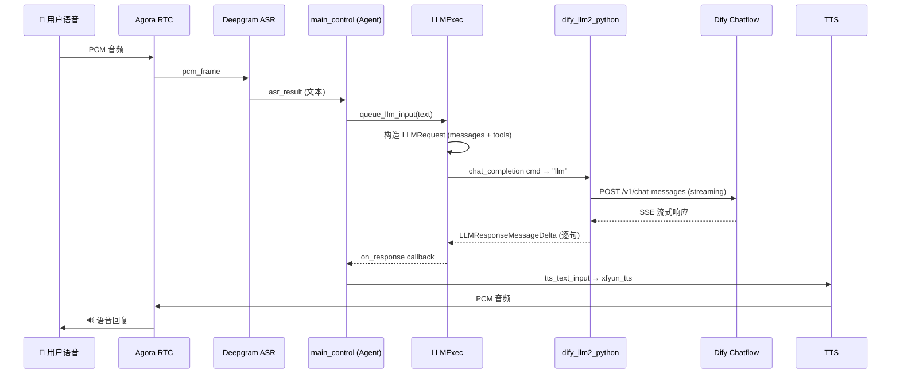

# Dify LLM 数据流全链路

> voice-assistant 通过 `dify_llm2_python` 扩展对接本地 Dify Chatflow 的端到端数据流。

## 关键节点

| 节点 | 扩展 | 说明 |
|------|------|------|
| `agora_rtc` | `agora_rtc` | Agora 实时音视频通信 |
| `stt` | `deepgram_asr_python` | 语音转文本（Deepgram） |
| `llm` | `dify_llm2_python` | LLM 对话（Dify Chatflow） |
| `tts` | `xfyun_tts_python` | 文本转语音（科大讯飞） |
| `main_control` | `main_python` | 主控编排（Agent 逻辑） |

## 通信方式

- **音频帧**: 通过 graph `connections` 中的 `audio_frame` 传递
- **命令/数据**: `main_control` 通过 `_send_cmd_ex` / `_send_data` 直接向命名节点发送，无需显式声明 connections
- **LLM 调用**: `LLMExec` 发送 `chat_completion` 命令 → `AsyncLLM2BaseExtension.on_cmd` 路由 → `on_call_chat_completion`
